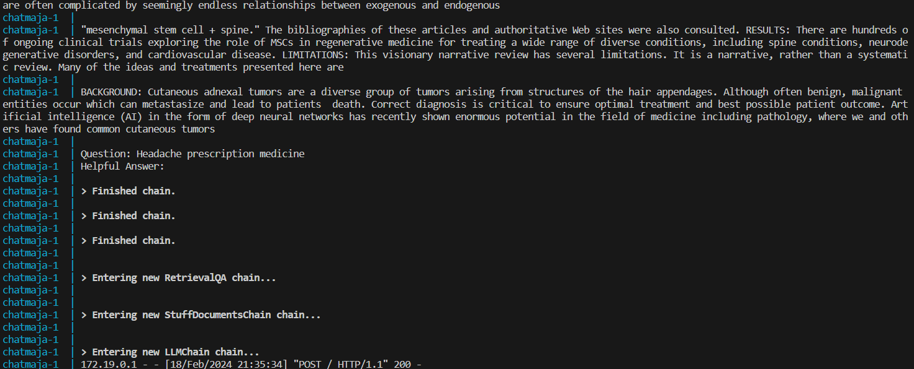
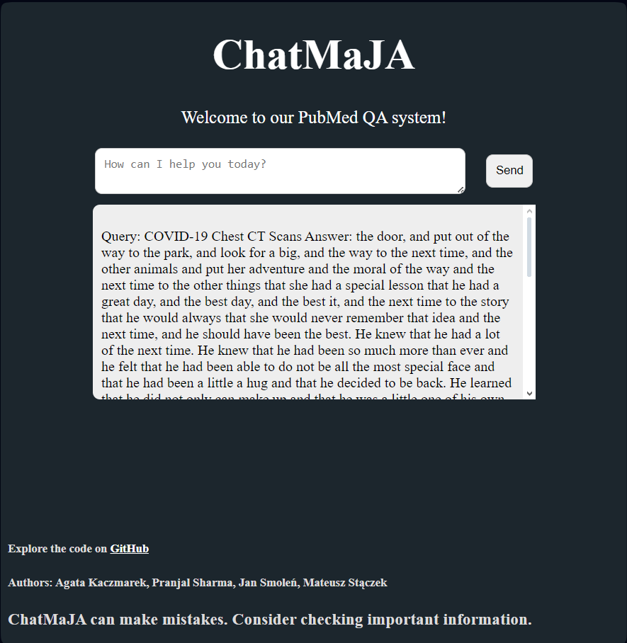

# Docker image with UI and backend proof-of-concept

Proof of concept Dockerized version of a QA system: 
- Loads ~400 chunks of texts with their embeddings from a csv file.
- Uses LanceDB and BM25 for retrieval. 
- `TinyLLama-v0` is used instead of `Llama-2` - poor generation, but proves that the system works. Can uncomment a few lines in `qa_pipeline.py` to use `Llama-2` instead.

#### Notes:

The idea was to put everything into one Docker container, but it turned out that the image is very large - 7.09 GB. Even with LLMs and LanceDB stored in mounted volumes.

Building the image for the first takes a very long time due to many large pip dependencies. Maybe not all of them are necessary? Also, model quantization was commented out, as it was causing errors with `TinyLLama-v0` and I was trying it locally without a proper GPU.

#### Screenshots:

Backend logs show retrieved chunks based on the input question. UI shows how the question and answer are presented.






## Contents:

### App:
- `app.py` - starting point, Flask app at http://127.0.0.1:5000/
- `qa_pipeline.py` - creates retrievers, loads models. Copied and slightly modified from another folder in the repository. 
- `master_with_embeddings.csv` - small csv with ~400 chunks of texts and their embeddings. Copied from another folder in the repository.
- `models/` - directory where HuggingFace models are stored.
- `db/` - directory where LanceDB is stored.
- `templates/` - directory with HTML templates for the Flask UI app.

### Docker:
- `requirements.txt` - Python packages required by the app and installed to the container when building an image (pip is cached)
- `Dockerfile` - to build an image with the app
- `.dockerignore` - selects file to copy in Dockerfile
- `docker-compose.yml` - to build an image and start a container with the app. Mounts `./db/` and `./models/` directories to the container.


## How to run - Docker / Docker Compose

> **Note:** commands below assume you're in the directory with the `app.py`, `Dockerfile` and `docker-compose.yml` files.

### Locally - with Docker

Build an image based on Dockerfile, then start a container from the image.

```bash
docker build -t chatmaja:v2 .
docker run -p 5000:5000 chatmaja:v2
```

Then, open http://localhost:5000/ in a web browser.

#### More details

When building an image, you can set different tags with `-t` option. The tag `chatmaja:v2` is just an example. 

You can change port the app is available in your local browser by changing the first port number in the `-p` option. For example, to run the app on port 5001, use `-p 5001:5000`. Note, that port number used by the container itself will remain `5000` which might be misleading when reading logs.

### Locally - with Docker Compose

The easiest way.

```bash
docker compose up -d
```

Then, open http://localhost:5000/.

#### More details

To see logs, start the app without `-d`:
```bash
docker compose up
```

The docker compose builds an image based on the Dockerfile in the current directory, tags the image as `chatmaja/v1` and starts a container. Port 5000 of the container is mapped to port 5000 of the host, so the http://localhost:5000/ works as expected.

## TODO:
- remove HF API key from Docker Compose