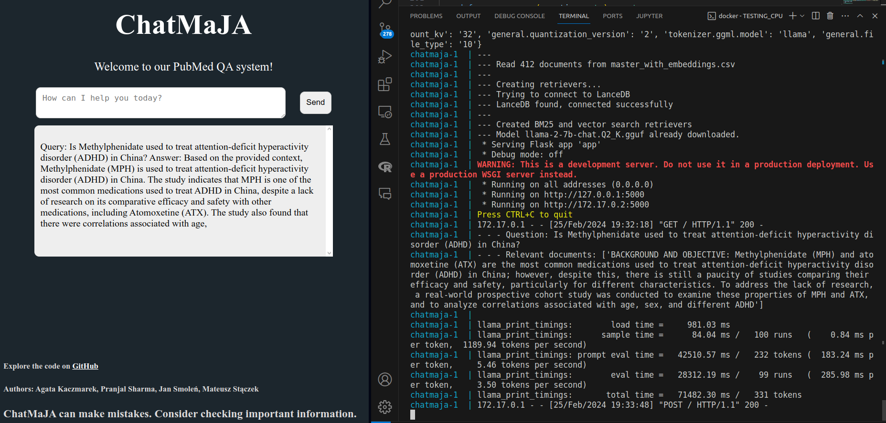

# Docker image with UI and backend proof-of-concept

First version of Dockerized version of a QA system: 
- Loads ~400 chunks of texts with their embeddings from a csv file.
- Uses LanceDB and BM25 for retrieval. 
- `llama-2-7b-chat.Q2_K.gguf` is used - so-so generation with CPU only. Can uncomment a few lines in `qa_pipeline.py` to use `Llama-2` or `TinyLLama-v0` instead.


Model: [llama-2-7b-chat.Q2_K](https://huggingface.co/TheBloke/Llama-2-7B-Chat-GGUF/blob/main/llama-2-7b-chat.Q2_K.gguf)

#### Notes:

Docker image is very large - 7.09 GB. Even with LLMs and LanceDB stored in mounted volumes. To cache pip install, a separate image was created, that is built from `Dockerfile.base` file.

Building the image for the first takes a very long time due to many large pip dependencies. Maybe not all of them are necessary? Also, model quantization was commented out, as it was causing errors with `TinyLLama-v0` and I was trying it locally without a GPU.

#### Screenshots:


Backend logs show that 2 chunks were retrieved based on the input question. UI shows how the question and answer are presented.




## Contents:

### App:
- `app.py` - starting point, Flask app at http://127.0.0.1:5000/
- `qa_pipeline.py` - creates retrievers, loads models. Based on the previous version, left previous code undeleted. 
- `master_with_embeddings.csv` - small csv with ~400 chunks of texts and their embeddings. Copied from another folder in the repository.
- `models/` - directory where HuggingFace models are stored.
- `db/` - directory where LanceDB is stored.
- `templates/` - directory with HTML templates for the Flask UI app.

### Docker:
- `requirements.txt` - Python packages required by the app and installed to the container when building an image (pip is cached)
- `Dockerfile.base` - to build an image with the Python packages installed.
- `Dockerfile` - to build an image with the app. Requires an image `chatmaja_base:v1` built from `Dockerfile.base`.
- `.dockerignore` - selects file to copy in Dockerfiles.
- `docker-compose.yml` - to build an image with app and start a container with the app. Mounts `./db/` and `./models/` directories to the container. 


## How to run - Docker / Docker Compose

> **Note:** commands below assume you're in the directory with the `app.py`, `Dockerfile.base`, `Dockerfile` and `docker-compose.yml` files.

### Locally - with Docker

Build an image based on Dockerfile, then start a container from the image.

```bash
docker build -t chatmaja_base:v1 -f Dockerfile.base .
docker build -t chatmaja:v3 .
docker run -v ./models:/app/models -v ./db:/app/db -p 5000:5000 chatmaja:v3 
```

Then, open http://localhost:5000/ in a web browser.

#### More details

When building an image, you can set different tags with `-t` option. The tag `chatmaja:v3` is just an example. However, you cannot change tag of the base image `chatmaja_base:v1` as it is later used in the file `Dockerfile`.

### Locally - with Docker Compose

The easiest way.

```bash
docker build -t chatmaja_base:v1 -f Dockerfile.base .
docker compose up -d
```

Then, open http://localhost:5000/.

#### More details

To see logs, start the app without `-d`:
```bash
docker build -t chatmaja_base:v1 -f Dockerfile.base .
docker compose up
```

The docker compose builds an image based on the Dockerfile in the current directory, tags the image as `chatmaja/v3` and starts a container. Port 5000 of the container is mapped to port 5000 of the host, so the http://localhost:5000/ works as expected.
