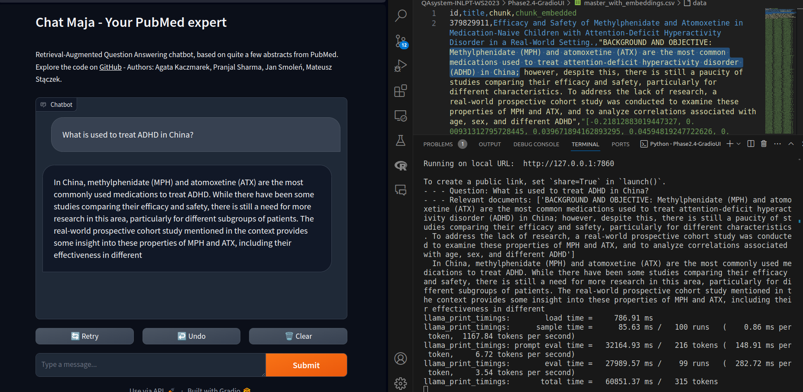

# Gradio basic UI and backend proof-of-concept

First version of QA system with simple Gradio UI: 
- Loads ~400 chunks of texts with their embeddings from a csv file.
- Uses LanceDB and BM25 for retrieval. 
- `llama-2-7b-chat.Q2_K.gguf` is used - so-so generation with CPU only. 
- Streaming output to UI - makes it feel more responsive than waiting a minute for the whole answer.


Model: [llama-2-7b-chat.Q2_K](https://huggingface.co/TheBloke/Llama-2-7B-Chat-GGUF/blob/main/llama-2-7b-chat.Q2_K.gguf)

#### Notes:

Can on Hugginface Spaces with Gradio, but not on the free plan (2vCPU and 16GB RAM is not enough). On an average laptop does work on CPU, but slowly.

Gradio UI is better than hand-crafted HTML + JS UI when prototyping.

#### Screenshots:

Backend logs show that 2 chunks were retrieved based on the input question (1 from BM25, 1 from vector similarity). UI shows how the question and answer are presented.




## Contents:

### App:
- `app.py` - starting point, Gradio app at http://127.0.0.1:7860/
- `qa_pipeline.py` - creates retrievers, loads models. Based on the previous version, left previous code undeleted. 
- `master_with_embeddings.csv` - small csv with ~400 chunks of texts and their embeddings. Copied from another folder in the repository.
- `models/` - directory where HuggingFace models are stored.
- `db/` - directory where LanceDB is stored.


## How to run

> **Note:** commands below assume you're in the directory with the `app.py` file.

### Locally

Run script `app.py`.

```bash
python app.py
```

Then, open http://localhost:7860/ in a web browser.

#### More details

Add set `share=True` in `launch()` to create a public link. 

Using Huggingface Spaces is a clean way to deploy the app BUT free tier performance is unusable (~10 minutes of initial waiting time and then 4 letters per 10 seconds).
